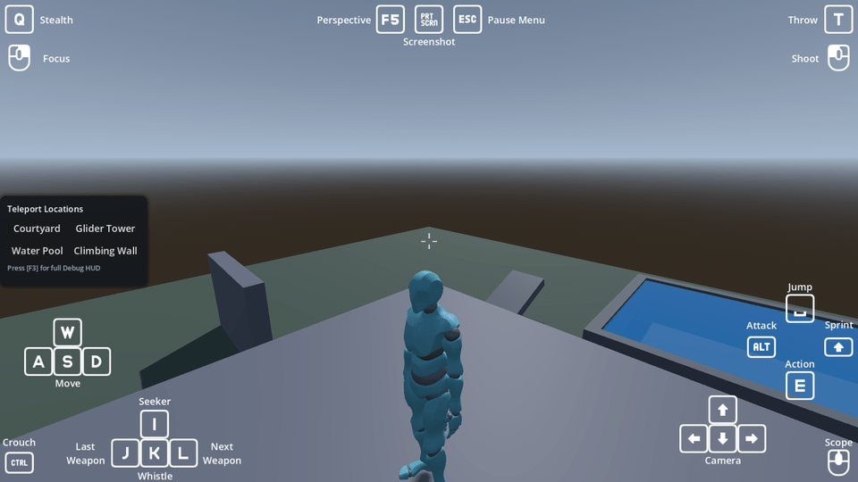

# 3D Player Controller for Godot 4.8+

A modular 3D character controller: a locomotion finite state machine on `CharacterBody3D` and
`AnimationTree` with root motion, first and third person cameras, equipment and combat, an
inventory and spell system, and Steam multiplayer.

**[Read the full documentation](addons/3d_player_controller/README.md)**, which ships with the addon so it is
there however you installed it.

Play the demo in a browser at <https://timothycope.com/godot-3d-player-controller-addon/>.

## This repository

It uses the layout the [Godot Asset Library](https://docs.godotengine.org/en/stable/community/asset_library/submitting_to_assetlib.html) expects, so it is both the addon and a
project you can open and edit it in:

```
project.godot                 the demo project, which is this repository
addons/3d_player_controller/  the addon itself
addons/controls/              the on-screen input hints
addons/gut/                   the test runner
```

Clone it, open `project.godot` in Godot, and run the demo scene. The addon is mounted at
`res://addons/3d_player_controller/` exactly as it is in a game, so it is edited in place with nothing copied
anywhere first. Installing through the Asset Library takes `addons/` and skips the root
`project.godot` as a conflict, which is why that file can live here harmlessly.

## Installing it in a game

Copy `addons/3d_player_controller/` into your project's `addons/`. See the
[addon's README](addons/3d_player_controller/README.md) for what it needs and how to use it.
