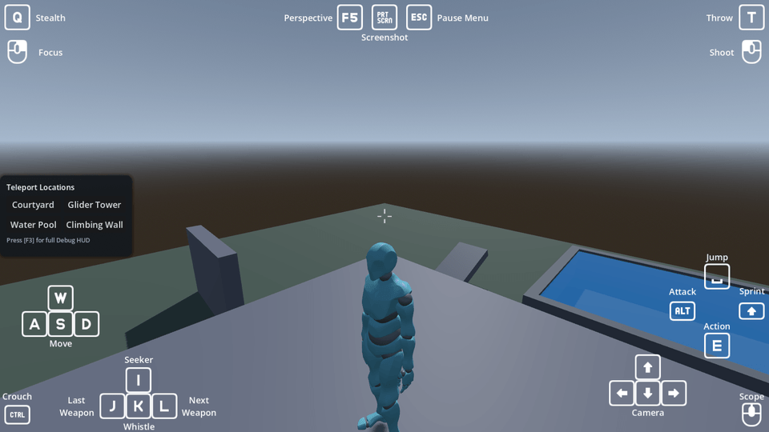

# 3D Player Controller for Godot 4.8+

A modular 3D character controller: a locomotion finite state machine on `CharacterBody3D` and
`AnimationTree` with root motion, first and third person cameras, equipment and combat, an
inventory and spell system, and Steam multiplayer.

**[Read the full documentation](addons/3d_player_controller/README.md)**, which ships with the addon so it is
there however you installed it.

Play the demo in a browser at <https://timothycope.com/godot-3d-player-controller-addon/>.

## This repository

It uses the layout the [Godot Asset Library](https://docs.godotengine.org/en/stable/community/asset_library/submitting_to_assetlib.html) expects, so it is both the addon and a
project you can open and edit it in:

```
project.godot                 the demo project, which is this repository
addons/3d_player_controller/  the addon itself
addons/controls/              the on-screen input hints the addon needs, committed here
addons/gut/                   the test runner, not committed (see Testing)
```

Clone it, open `project.godot` in Godot, and run the demo scene. The addon is mounted at
`res://addons/3d_player_controller/` exactly as it is in a game, so it is edited in place with nothing copied
anywhere first. Installing through the Asset Library takes `addons/` and skips the root
`project.godot` as a conflict, which is why that file can live here harmlessly; `.gitattributes` keeps
everything outside `addons/` out of the archive GitHub hands the Asset Library.

`addons/controls/` is a copy of the [Controls addon](https://github.com/kirbycope/godot-controls). To take a
newer one, copy that repository's `addons/controls/` over this one.

## Installing it in a game

Install it from the Asset Library, or copy both `addons/3d_player_controller/` and `addons/controls/` into
your project's `addons/`. See the [addon's README](addons/3d_player_controller/README.md) for what it
needs and how to use it.

## Testing

The tests run on [GUT](https://github.com/bitwes/Gut) 9.7.1, which is not committed. Clone it once into
`addons/gut/`:

```bash
git clone --depth 1 --branch v9.7.1 https://github.com/bitwes/Gut.git /tmp/gut && cp -R /tmp/gut/addons/gut addons/gut
```

Then run the suite headless from the repository root:

```powershell
& 'C:\Godot\godot.exe' --headless --audio-driver Dummy --path . -s addons/gut/gut_cmdln.gd -gconfig=res://.gutconfig.json -gexit
```

## Releases and CI

A pull request merged into `main` cuts a release, and nothing else does short of a manual run:
`.github/workflows/release-addon.yml` publishes `addons/3d_player_controller/` and `addons/controls/` as
`3d_player_controller-vX.Y.Z.zip` on the [Releases](https://github.com/kirbycope/godot-3d-player-controller-addon/releases)
page, then moves `config/version` in `project.godot` and `version` in the addon's `plugin.cfg` on to the next
development version. `.github/workflows/gut-tests.yml` runs the tests on every push and pull request, fetching
GUT the same way as above, and a run whose JUnit report holds no test at all fails the job as a failing test would.
